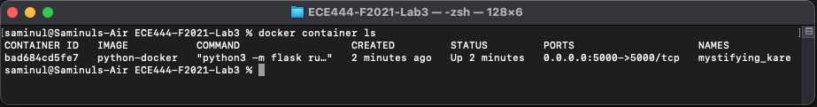

# Lab 3 for ECE444 Fall 2021

By: Saminul Islam

This   repo   is   a   clone   of https://github.com/nelaturuk/education_pathways.

## Activity 1

## Activity 2

## Activity 3

## Activity 4

### Flask App Running on localhost:5000

### Running Docker image

## Activity 5

### Functional Requirements

One functional requirement I would like to see is being able to view courses based on a more specific search criteria. Such as: being able to chose "ECE Area 6" or search for "AI Minor" and get relevant results.

### Non-functional Requirements

For the non-functional requirement, I would want to improve the CORRECTNESS of the system. It is important that the course information shown to the users is correct and up-to date. For example in the ECE444 page for the system, it looks like the pre-requisistes are ECE344 AND ECE353 but it actually is either one of the courses so the information is not correctly portrayed.

